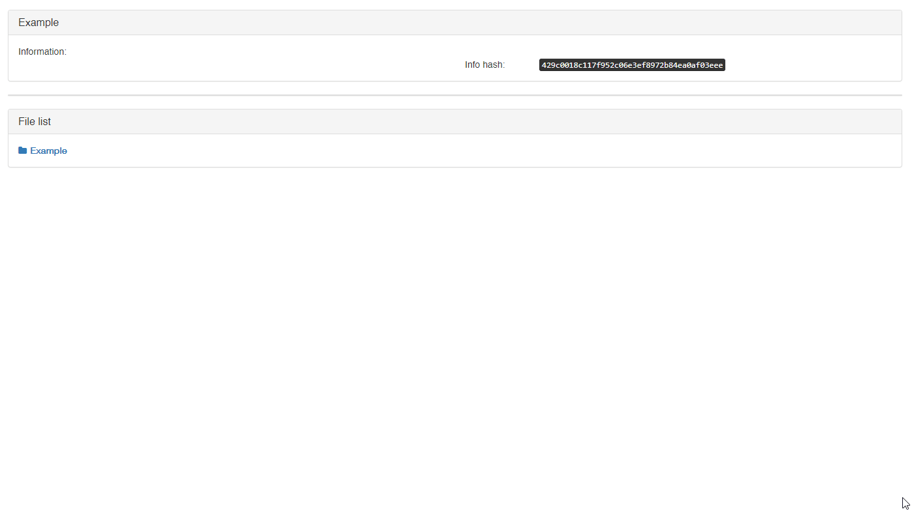

# Hash2Mag

A Chrome extension / Web-based utility that converts a BitTorrent info hash (SHA-1) into a torrent magnet link.

## Usage

## Releases

👉[Get extension](https://github.com/upbooo/h2m/releases)👈

## Live at

👉[hash2mag](https://h2m.upbooo.com)👈
